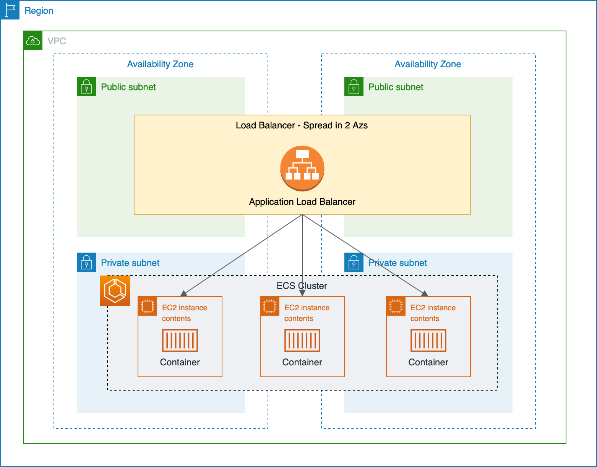
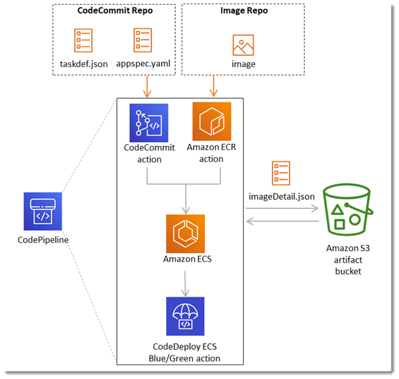
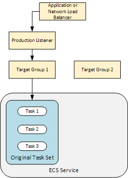
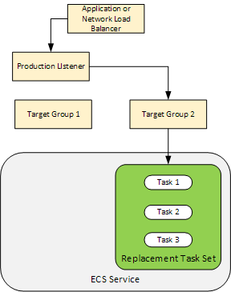

# ecs-demo-app

This demonstration have teh purporse to demonstrate how to create an ECS Cluster and service and use AWS Services for CI/CD (CodePipeline, CodeBuild and CodeDeploy) to create a process implementing Blue/Green Deployment strategie.

# Architecture Diagram

The cluster architecture diagram that we are going to provision in the Demonstration with EC2 Nodes.

 

# CI/CD Diagram

This is a sample architecture of our CI/CD process using CodePipeline, CodeBuild and CodeDeploy

 

## Blue Green Strategy

During an Amazon ECS deployment, CodeDeploy uses a load balancer that is configured with two target groups and one production traffic listener. The following diagram shows how the load balancer, production listener, target groups, and your Amazon ECS application are related before the deployment starts. This tutorial uses an Application Load Balancer. You can also use a Network Load Balancer.

 

After a successful deployment, the production traffic listener serves traffic to your new replacement task set and the original task set is terminated. The following diagram shows how your resources are related after a successful deployment.

 

